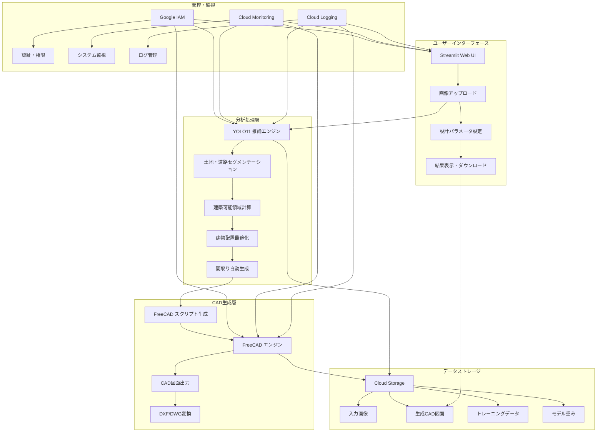

# 土地図から一軒家CAD図自動生成システム - プロジェクト構成

## システム概要

土地図をアップロードするだけで一軒家のCAD図を自動的に生成するシステム。YOLO11ベースの土地・道路分析からFreeCADを活用したCAD図面生成までを一貫して行う。

## システムアーキテクチャ



## Google Cloudリソース構成

| リソース                               | 用途                  | 詳細設定                    |
|------------------------------------|-----------------------|-----------------------------|
| **Vertex AI**                      | YOLO11モデルのトレーニングと推論 | カスタムコンテナ、GPUインスタンス          |
| **Cloud Storage**                  | データ・モデル・CAD図の保存    | 階層化ストレージ、適切なアクセス制御   |
| **Cloud Run**                      | Streamlitアプリのホスティング   | オートスケール、メモリ最適化           |
| **GKE (Google Kubernetes Engine)** | FreeCADサーバーの実行      | 必要に応じたスケーリング、永続ボリューム   |
| **Cloud Build**                    | CI/CDパイプライン           | ソースコード変更時の自動ビルド・デプロイ   |
| **Firebase Authentication**        | ユーザー認証              | メール認証、必要に応じてGoogle連携 |
| **Cloud Firestore**                | ユーザーデータ・生成結果の保存 | NoSQLデータベース                 |
| **Secret Manager**                 | API鍵などの機密情報管理  | 適切なアクセス制御               |
| **Cloud Monitoring**               | システム監視              | アラート設定、ダッシュボード            |
| **Cloud Logging**                  | ログ収集・分析           | 集中管理、フィルタリング            |

## コンテナ構成

### 1. YOLO11 トレーニングコンテナ
- **ベースイメージ**: NVIDIA CUDA + Python
- **主要コンポーネント**: ultralytics, OpenCV, Google Cloud SDK
- **機能**: セグメンテーションモデルのトレーニング

### 2. YOLO11 推論コンテナ
- **ベースイメージ**: Python Slim
- **主要コンポーネント**: ultralytics, OpenCV, NumPy
- **機能**: 土地・道路のセグメンテーション、建築可能領域計算

### 3. Streamlit アプリコンテナ
- **ベースイメージ**: Python
- **主要コンポーネント**: Streamlit, Google Cloud クライアントライブラリ
- **機能**: WebUI提供、ユーザー入力処理、結果表示

### 4. FreeCAD サーバーコンテナ
- **ベースイメージ**: Ubuntu
- **主要コンポーネント**: FreeCAD, Python API
- **機能**: CAD図面生成

## データフロー

1. **入力処理**:
   - ユーザーがStreamlit UIから土地図をアップロード
   - 画像はCloud Storageに保存
   - 処理パラメータ設定

2. **分析処理**:
   - YOLO11推論エンジンが土地・道路をセグメンテーション
   - 建築可能領域を計算（法規制も考慮）
   - 最適な建物配置と間取りを自動生成

3. **CAD生成**:
   - 最適化された建物データからFreeCADスクリプトを生成
   - FreeCADエンジンでスクリプトを実行
   - CAD図面を生成しCloud Storageに保存

4. **出力処理**:
   - 生成されたCAD図面をStreamlit UIに表示
   - ユーザーがDXF/DWG形式でダウンロード

## ディレクトリ構造

```
house-design-ai/
├── terraform/               # インフラストラクチャコード
│   ├── main.tf             # メインTerraform構成
│   ├── variables.tf        # 変数定義
│   ├── outputs.tf          # 出力定義
│   ├── storage.tf          # Storageリソース
│   ├── compute.tf          # 計算リソース(Vertex AI, GKE)
│   ├── network.tf          # ネットワーク構成
│   └── iam.tf              # 権限設定
│
├── deployment/             # デプロイメント関連
│   ├── dockerfiles/        # コンテナ定義
│   │   ├── yolo-train/     # YOLOトレーニングコンテナ
│   │   ├── yolo-inference/ # YOLO推論コンテナ
│   │   ├── streamlit-app/  # Streamlit UIコンテナ
│   │   └── freecad-server/ # FreeCADサーバーコンテナ
│   ├── k8s/                # Kubernetes構成
│   └── cloud-build/        # CI/CD設定
│
├── src/                    # ソースコード
│   ├── yolo/               # YOLO関連コード
│   │   ├── train.py        # トレーニングスクリプト
│   │   ├── inference.py    # 推論処理
│   │   └── processing/     # 画像・マスク処理
│   ├── design/             # 建物設計関連
│   │   ├── optimizer.py    # 建物配置最適化
│   │   ├── floorplan.py    # 間取り生成
│   │   └── constraints.py  # 制約条件処理
│   ├── cad/                # CAD関連
│   │   ├── freecad_client.py  # FreeCAD連携
│   │   ├── script_generator.py # スクリプト生成
│   │   └── templates/      # FreeCADスクリプトテンプレート
│   └── api/                # APIレイヤー
│       ├── routes.py       # エンドポイント定義
│       └── storage.py      # ストレージ連携
│
├── streamlit/              # Streamlitアプリ
│   ├── app.py              # メインアプリケーション
│   ├── pages/              # 追加ページ
│   └── components/         # UIコンポーネント
│
├── configs/                # 設定ファイル
│   ├── yolo_config.yaml    # YOLOモデル設定
│   ├── building_params.yaml # 建物パラメータ設定
│   └── cad_templates.yaml  # CADテンプレート設定
│
├── tests/                  # テストコード
│   ├── unit/               # ユニットテスト
│   └── integration/        # 統合テスト
│
└── docs/                   # ドキュメント
```

## デプロイメントフロー

1. **インフラストラクチャプロビジョニング**:
   - Terraformによる基盤リソースの作成
   - ネットワーク・IAM・ストレージの設定

2. **コンテナビルド**:
   - Cloud BuildによるDockerイメージのビルド
   - Artifact Registryへのプッシュ

3. **サービスデプロイメント**:
   - YOLOモデルのVertex AIへのデプロイ
   - FreeCADサーバーのGKEへのデプロイ
   - StreamlitアプリのCloud Runへのデプロイ

4. **監視・運用設定**:
   - Cloud Monitoringダッシュボードの設定
   - アラート設定
   - ロギング構成

## 拡張性と将来計画

- **3Dモデル生成**: 平面CAD図から3Dモデルへの拡張
- **詳細建築プラン**: 構造計算や設備計画の自動化
- **AI改善サイクル**: ユーザーフィードバックに基づくモデル改善
- **API提供**: 他システムとの連携のためのAPIエンドポイント
- **拡張現実(AR)連携**: 現地での建物可視化

以上の構成は、土地図から一軒家CAD図を自動生成するシステムの基盤となります。Google Cloudを活用し、Terraformで一元管理することで、スケーラブルで保守性の高いシステムを実現します。