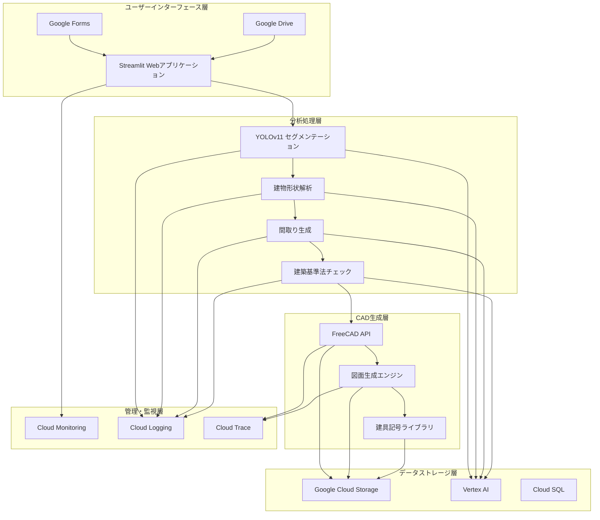
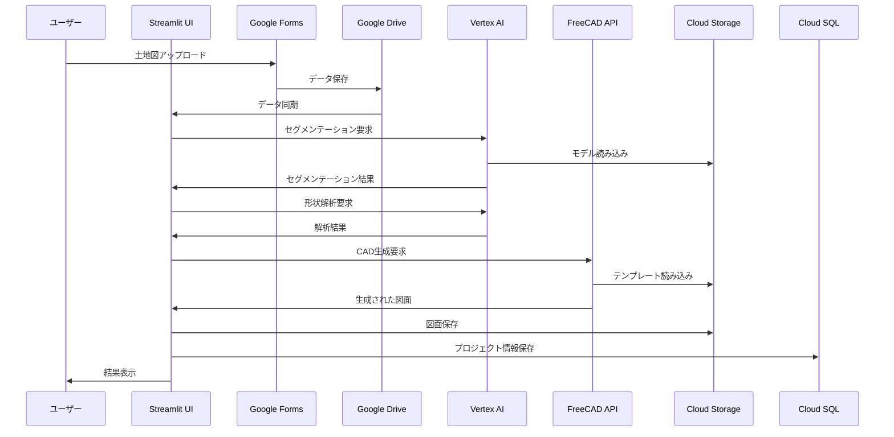
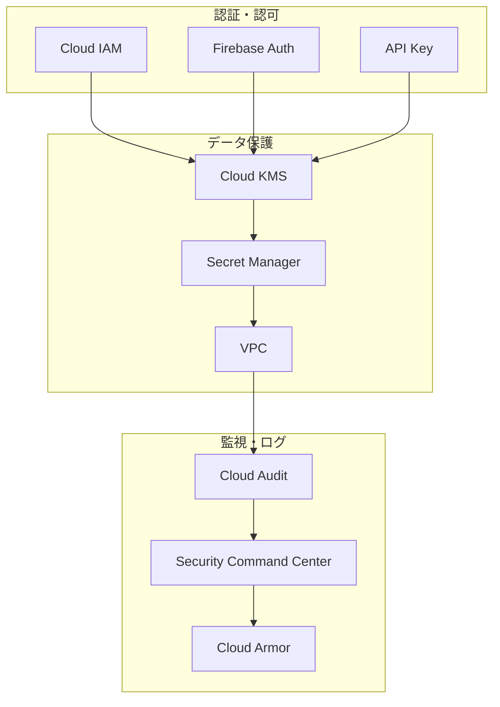
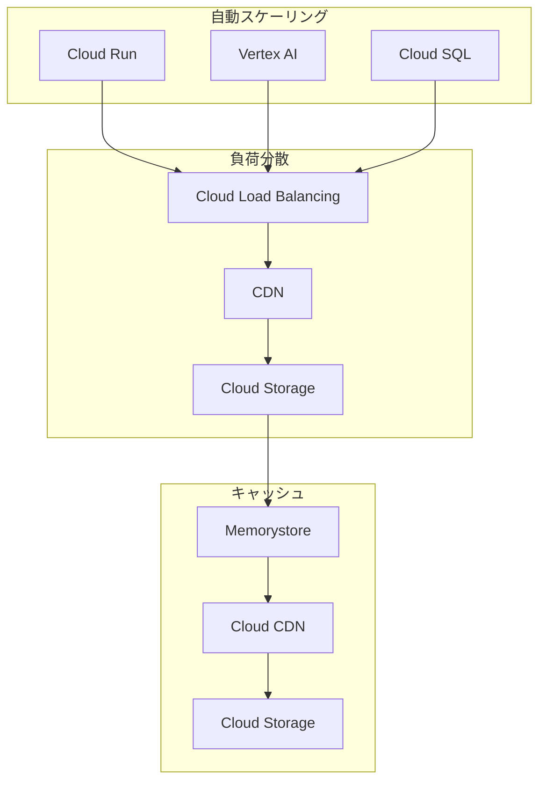

# 土地図からの一軒家CAD図自動生成システム システム構造図

## システム全体構成

## コンポーネント詳細

### 1. ユーザーインターフェース層
- **Streamlit Webアプリケーション**
  - Cloud Run上で動作
  - ユーザー認証・認可
  - インタラクティブなUI
  - リアルタイムフィードバック
- **Google Forms/Drive連携**
  - データ入力フォーム
  - ファイル管理
  - 自動データ同期

### 2. 分析処理層
- **YOLOv8 セグメンテーション**
  - Vertex AI上で動作
  - 高精度な建物検出
  - リアルタイム処理
- **建物形状解析**
  - 建築可能エリアの特定
  - 形状最適化
  - 制約条件の適用
- **間取り生成**
  - 自動レイアウト生成
  - 最適化アルゴリズム
  - カスタマイズオプション
- **建築基準法チェック**
  - 建蔽率・容積率チェック
  - 日影規制チェック
  - 高さ制限チェック

### 3. CAD生成層
- **FreeCAD API**
  - Cloud Run上で動作
  - ヘッドレスモード
  - 高性能な3D処理
- **図面生成エンジン**
  - 自動図面生成
  - レイヤー管理
  - 寸法線生成
- **建具記号ライブラリ**
  - 標準記号セット
  - カスタム記号対応
  - バージョン管理

### 4. データストレージ層
- **Google Cloud Storage**
  - モデルファイル
  - 生成された図面
  - 一時データ
- **Vertex AI**
  - モデルトレーニング
  - 推論エンドポイント
  - モデル管理
- **Cloud SQL**
  - ユーザーデータ
  - プロジェクト管理
  - 設定情報

### 5. 管理・監視層
- **Cloud Monitoring**
  - システムメトリクス
  - アラート設定
  - ダッシュボード
- **Cloud Logging**
  - アプリケーションログ
  - エラートレース
  - 監査ログ
- **Cloud Trace**
  - パフォーマンス分析
  - ボトルネック特定
  - 分散トレース

## データフロー

## セキュリティ構成

## スケーリング構成

