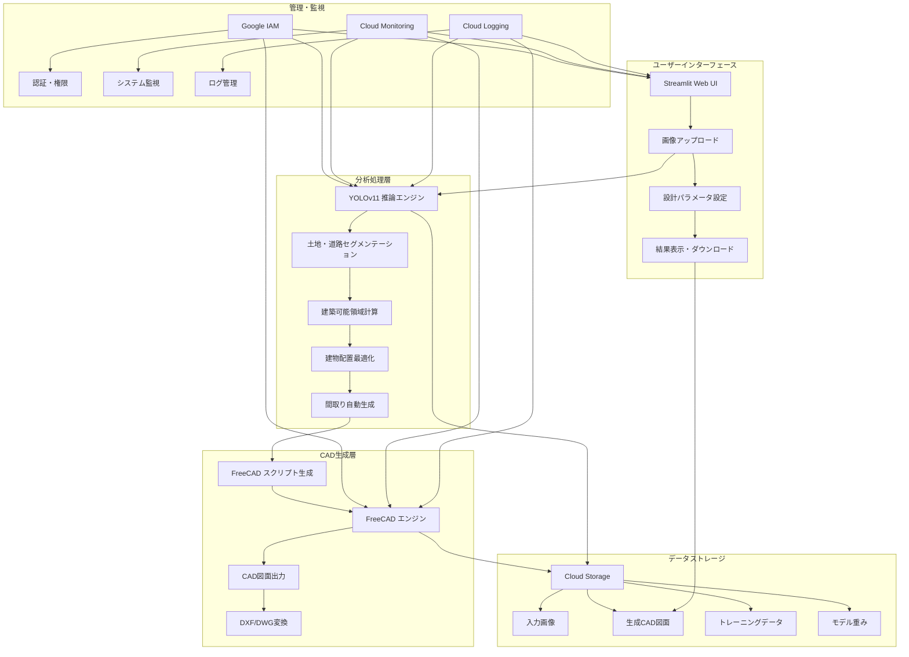

# 土地図から一軒家CAD図自動生成システム - プロジェクト構成

## システム概要

土地図をアップロードするだけで一軒家のCAD図を自動的に生成するシステム。YOLOv11ベースの土地・道路分析からFreeCADを活用したCAD図面生成までを一貫して行う。将来的にはYOLOv12への移行も計画されている。

## システムアーキテクチャ



## Google Cloudリソース構成

| リソース                               | 用途                   | 詳細設定                    |
|------------------------------------|------------------------|-----------------------------|
| **Vertex AI**                      | YOLOv11モデルのトレーニングと推論 | カスタムコンテナ、GPUインスタンス          |
| **Cloud Storage**                  | データ・モデル・CAD図の保存     | 階層化ストレージ、適切なアクセス制御   |
| **Cloud Run**                      | Streamlitアプリのホスティング    | オートスケール、メモリ最適化           |
| **GKE (Google Kubernetes Engine)** | FreeCADサーバーの実行       | 必要に応じたスケーリング、永続ボリューム   |
| **Cloud Build**                    | CI/CDパイプライン            | ソースコード変更時の自動ビルド・デプロイ   |
| **Firebase Authentication**        | ユーザー認証               | メール認証、必要に応じてGoogle連携 |
| **Cloud Firestore**                | ユーザーデータ・生成結果の保存  | NoSQLデータベース                 |
| **Secret Manager**                 | API鍵などの機密情報管理   | 適切なアクセス制御               |
| **Cloud Monitoring**               | システム監視               | アラート設定、ダッシュボード            |
| **Cloud Logging**                  | ログ収集・分析            | 集中管理、フィルタリング            |

## コンテナ構成

### 1. YOLOv11 トレーニングコンテナ
- **ベースイメージ**: NVIDIA CUDA + Python
- **主要コンポーネント**: ultralytics, OpenCV, Google Cloud SDK
- **機能**: セグメンテーションモデルのトレーニング

### 2. YOLOv11 推論コンテナ
- **ベースイメージ**: Python Slim
- **主要コンポーネント**: ultralytics, OpenCV, NumPy
- **機能**: 土地・道路のセグメンテーション、建築可能領域計算

### 3. Streamlit アプリコンテナ
- **ベースイメージ**: Python
- **主要コンポーネント**: Streamlit, Google Cloud クライアントライブラリ
- **機能**: WebUI提供、ユーザー入力処理、結果表示

### 4. FreeCAD サーバーコンテナ
- **ベースイメージ**: Ubuntu
- **主要コンポーネント**: FreeCAD, Python API
- **機能**: CAD図面生成

## データフロー

1. **入力処理**:
   - ユーザーがStreamlit UIから土地図をアップロード
   - 画像はCloud Storageに保存
   - 処理パラメータ設定

2. **分析処理**:
   - YOLOv11推論エンジンが土地・道路をセグメンテーション
   - 建築可能領域を計算（法規制も考慮）
   - 最適な建物配置と間取りを自動生成

3. **CAD生成**:
   - 最適化された建物データからFreeCADスクリプトを生成
   - FreeCADエンジンでスクリプトを実行
   - CAD図面を生成しCloud Storageに保存

4. **出力処理**:
   - 生成されたCAD図面をStreamlit UIに表示
   - ユーザーがDXF/DWG形式でダウンロード

## ディレクトリ構造

```
house-design-ai/
├── terraform/               # インフラストラクチャコード
│   ├── main.tf             # メインTerraform構成
│   ├── variables.tf        # 変数定義
│   ├── outputs.tf          # 出力定義
│   ├── storage.tf          # Storageリソース
│   ├── compute.tf          # 計算リソース(Vertex AI, GKE)
│   ├── network.tf          # ネットワーク構成
│   └── iam.tf              # 権限設定
│
├── deploy/                 # デプロイメント関連
│   ├── dockerfiles/        # コンテナ定義
│   ├── k8s/                # Kubernetes構成
│   └── cloud-build/        # CI/CD設定
│
├── src/                    # ソースコード
│   ├── cloud/              # クラウド連携 (Vertex AI)
│   ├── processing/         # 画像処理ロジック
│   ├── utils/              # ユーティリティ関数
│   ├── visualization/      # 可視化ツール
│   ├── cli.py              # コマンドラインインターフェース
│   ├── train.py            # モデルトレーニングロジック
│   └── inference.py        # 推論ロジック
│
├── house_design_app/       # Streamlitアプリケーション
│   ├── app.py              # メインアプリケーション
│   ├── pages/              # 追加ページ
│   └── components/         # UIコンポーネント
│
├── freecad_api/            # FreeCAD連携API
│   ├── server.py           # FreeCADサーバー
│   ├── client.py           # FreeCADクライアント
│   └── templates/          # FreeCADスクリプトテンプレート
│
├── config/                 # 設定ファイル
│   ├── data.yaml           # データ設定
│   └── service_account.json # サービスアカウント認証情報
│
├── tests/                  # テストコード
│   ├── unit/               # ユニットテスト
│   └── integration/        # 統合テスト
│
├── notebooks/              # Jupyter notebooks
│
├── datasets/               # データセットディレクトリ
│
├── scripts/                # ユーティリティスクリプト
│
├── DOCS/                   # ドキュメント
│   └── 0407/               # 2024年4月7日のドキュメント
│
├── requirements.txt        # 依存関係
├── requirements-dev.txt    # 開発用依存関係
├── Dockerfile              # Dockerイメージ定義
├── run.sh                  # 実行スクリプト
├── ROADMAP.md              # ロードマップ
└── CLOUD_DEPLOYMENT_PLAN.md # クラウドデプロイメント計画
```

## デプロイメントフロー

1. **インフラストラクチャプロビジョニング**:
   - Terraformによる基盤リソースの作成
   - ネットワーク・IAM・ストレージの設定

2. **コンテナビルド**:
   - Cloud BuildによるDockerイメージのビルド
   - Artifact Registryへのプッシュ

3. **サービスデプロイメント**:
   - YOLOv11モデルのVertex AIへのデプロイ
   - FreeCADサーバーのGKEへのデプロイ
   - StreamlitアプリのCloud Runへのデプロイ

4. **監視・運用設定**:
   - Cloud Monitoringダッシュボードの設定
   - アラート設定
   - ロギング構成

## 拡張性と将来計画

- **3Dモデル生成**: 平面CAD図から3Dモデルへの拡張
- **詳細建築プラン**: 構造計算や設備計画の自動化
- **AI改善サイクル**: ユーザーフィードバックに基づくモデル改善
- **API提供**: 他システムとの連携のためのAPIエンドポイント
- **拡張現実(AR)連携**: 現地での建物可視化

以上の構成は、土地図から一軒家CAD図を自動生成するシステムの基盤となります。Google Cloudを活用し、Terraformで一元管理することで、スケーラブルで保守性の高いシステムを実現します。